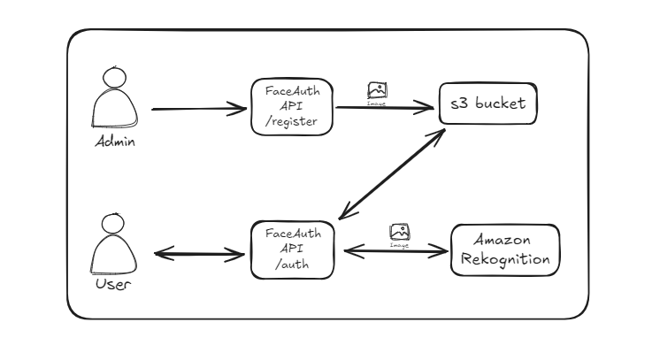
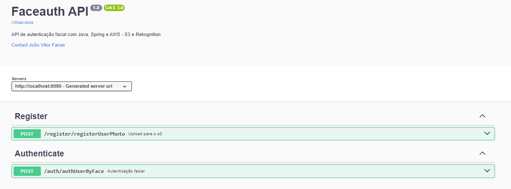

# FaceAuth API
API de autenticação Facial

## Descrição

Aplicação de autenticação facial desenvolvida em Java usando Spring Boot e serviços da AWS, como S3 e Rekognition. Esta API permite o registro e autenticação de usuários através do reconhecimento facial, utilizando imagens armazenadas em um bucket S3 e processadas pelo serviço de reconhecimento facial da Amazon Rekognition.

## 🛠️ Ferramentas Utilizadas

<p>
  <a href="https://skillicons.dev">
    
  </a>
</p>


## Fluxo Básico da API
  


## Tecnologias e conceitos utilizados
- Java
- Spring boot
- AWS Cloud Services - Amazon s3 | Amazon Rekognition
- Swagger
- Autenticação Facial
- Tratamento personalizado de erros em uma API

## Como executar a aplicação

1. **Clone o repositório**:
    ```bash
    git clone https://github.com/seuusuario/faceauth-api.git
    cd faceauth-api
    ```

2. **Configure as credenciais da AWS**:
    Crie um arquivo `.env` em e adicione suas credenciais da AWS:
    ```properties
    AWS_ACCESS_KEY_ID=SEU_ACESS_KEY
    AWS_SECRET_ACCESS_KEY=SEU_SECRET_KEY
    BUCKET_NAME=NOME-DO-SEU-BUCKET
    ```

3. **Execute a aplicação**:

## Usando a aplicação

### Endpoints

  

1. **Registrar Foto**:  
   `POST /register/registerUserPhoto`
   - **Descrição**: Faz o upload de uma imagem para o S3 e a indexa no Rekognition.
   - **Parâmetro**: `photo` (MultipartFile) - A foto a ser enviada.
   - **Resposta**: Mensagem de sucesso ou erro.

2. **Autenticar Usuário por Foto**:  
   `POST /auth/authUserByFace`
   - **Descrição**: Verifica se o rosto na foto enviada corresponde a um rosto já registrado.
   - **Parâmetro**: `photo` (MultipartFile) - A foto a ser verificada.
   - **Resposta**: JSON com nome do usuário e percentual de similaridade.


## Contato

**Desenvolvedor**: João Vitor Farias 

**LinkedIn**: [LinkedIn]([https://www.linkedin.com/in/seulinkedin](https://www.linkedin.com/in/jo%C3%A3o-vitor-farias-soares-216870238/))
